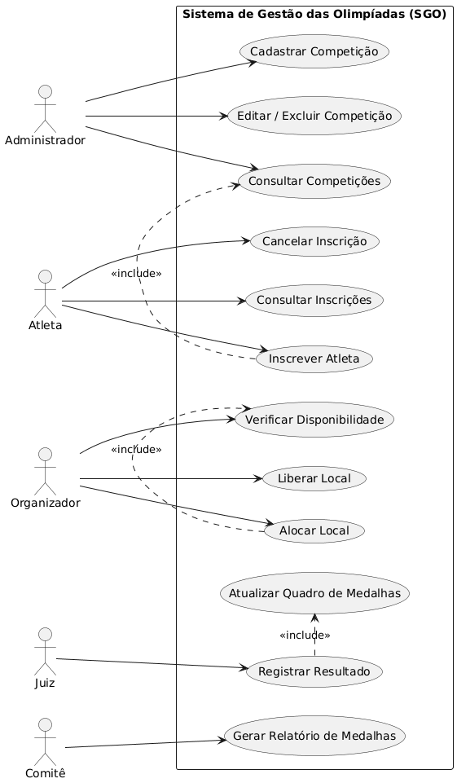
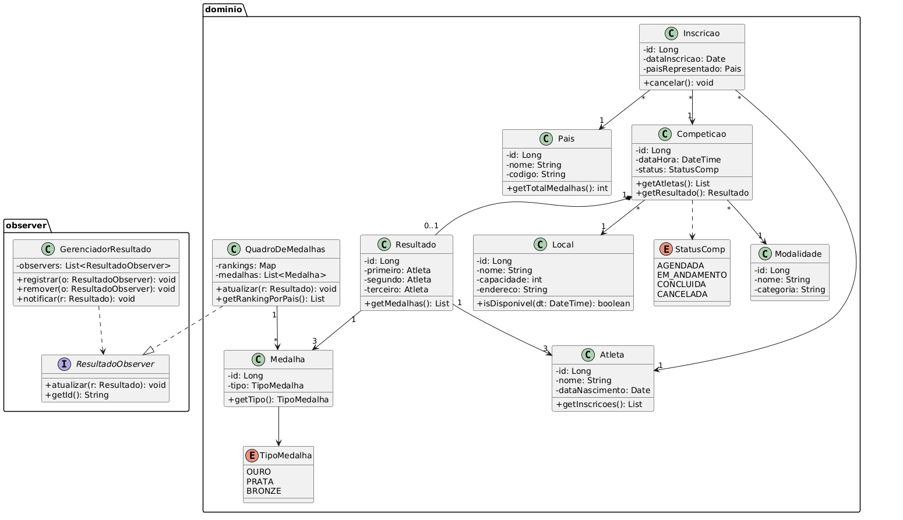
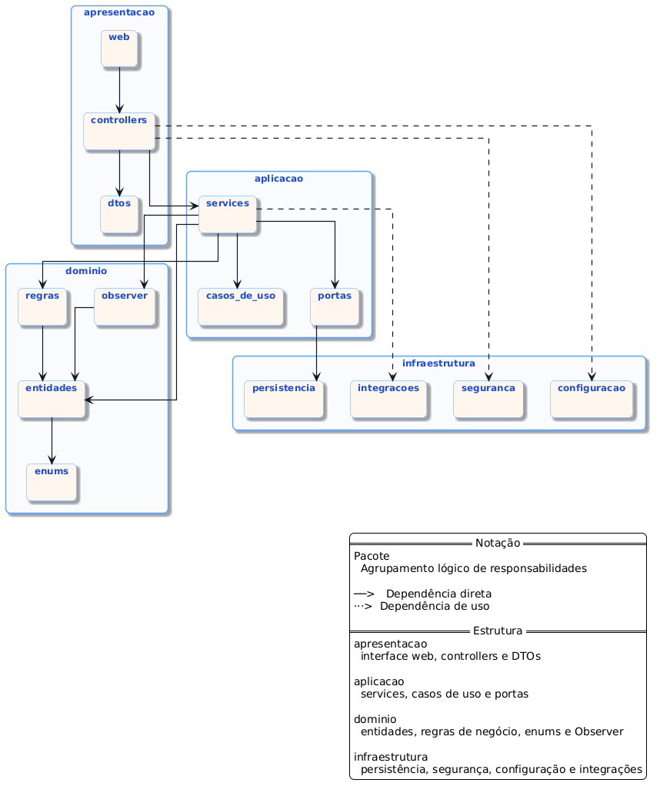
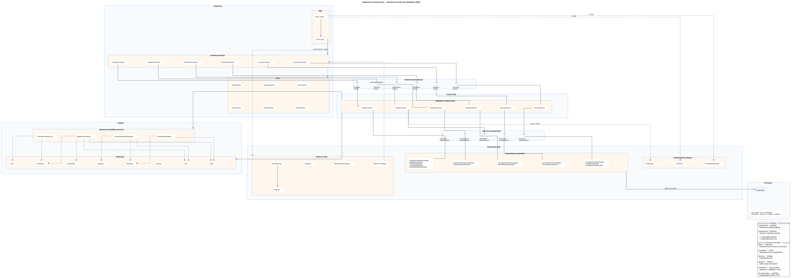
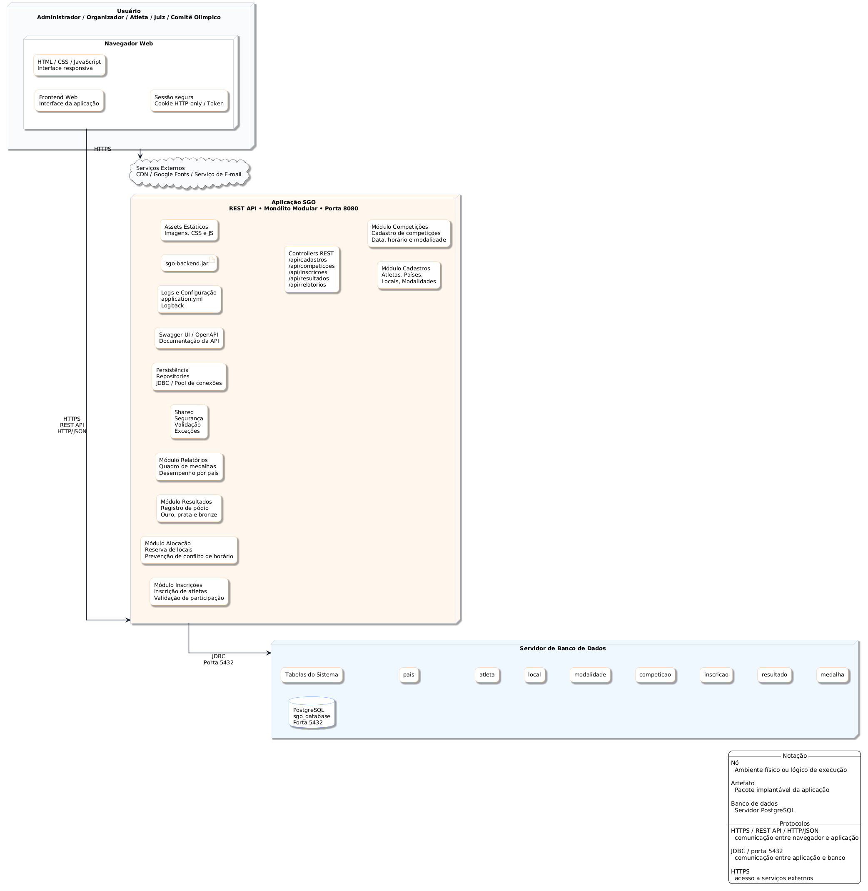

# Sistema de Gestão das Olimpíadas (SGO)

> Modelagem UML completa de um sistema para coordenar competições, inscrições de atletas, alocação de locais e controle de resultados olímpicos.


---

## Índice

- [Visão Geral](#visão-geral)
- [Regras de Negócio](#regras-de-negócio)
- [Histórias de Usuário](#histórias-de-usuário)
- [Diagramas](#diagramas)
  - [Diagrama de Caso de Uso](#diagrama-de-caso-de-uso)
  - [Diagrama de Classes](#diagrama-de-classes)
  - [Diagrama de Pacotes](#diagrama-de-pacotes)
  - [Diagrama de Componentes](#diagrama-de-componentes)
  - [Diagrama de Implantação](#diagrama-de-implantação)
- [Arquitetura](#arquitetura)
- [Padrão de Projeto](#padrão-de-projeto)
- [Estrutura do Repositório](#estrutura-do-repositório)
- [Como Visualizar os Diagramas](#como-visualizar-os-diagramas)
- [Autores](#autores)

---

## Visão Geral

O SGO é um sistema projetado para coordenar os diferentes aspectos de uma Olimpíada. Ele permite o gerenciamento de competições, inscrições de atletas, alocação de locais para as provas e controle de resultados, além de gerar relatórios de medalhas por país.

Este repositório contém exclusivamente a **modelagem e diagramação** do sistema, desenvolvida como trabalho da disciplina de Projeto de Software.

---

## Regras de Negócio

**RN1 — Cadastro de competições**
O sistema deve permitir o cadastro de competições contendo nome da modalidade, data, horário, local e lista de atletas inscritos.

**RN2 — Inscrição de atletas**
Atletas de diferentes países podem se inscrever em competições específicas. Cada atleta pode participar de várias competições, mas só pode representar um país por modalidade.

**RN3 — Alocação de locais**
Os locais devem ser alocados de forma a evitar conflitos de horário. Um local só pode abrigar uma competição por vez.

**RN4 — Controle de resultados**
Após a realização das competições, os resultados devem ser registrados determinando o atleta vencedor e os classificados em segundo e terceiro lugares.

**RN5 — Relatórios de medalhas**
O sistema deve gerar relatórios de medalhas mostrando o desempenho de cada país com base nas medalhas de ouro, prata e bronze conquistadas.

---

## Histórias de Usuário

**US01 — Cadastrar competição**
Como Administrador, quero cadastrar uma competição informando modalidade, data, horário e local, para que ela fique disponível para inscrições de atletas.

**US02 — Editar ou excluir competição**
Como Administrador, quero editar ou excluir uma competição cadastrada, para corrigir informações ou cancelar eventos.

**US03 — Consultar competições**
Como Administrador ou Atleta, quero consultar as competições disponíveis, para verificar modalidades, datas e locais.

**US04 — Inscrever atleta em competição**
Como Atleta, quero me inscrever em uma competição informando o país que represento naquela modalidade, para participar oficialmente do evento.

**US05 — Cancelar inscrição**
Como Atleta, quero cancelar minha inscrição em uma competição, para me retirar de um evento que não poderei participar.

**US06 — Consultar inscrições**
Como Atleta, quero consultar minhas inscrições ativas, para acompanhar em quais competições estou registrado.

**US07 — Alocar local para competição**
Como Organizador, quero alocar um local para uma competição, para garantir que o espaço esteja reservado sem conflito de horário.

**US08 — Verificar disponibilidade de local**
Como Organizador, quero verificar a disponibilidade de um local em determinada data e horário, para evitar sobreposição de eventos.

**US09 — Liberar local**
Como Organizador, quero liberar um local após o encerramento de uma competição, para que ele possa ser alocado a outros eventos.

**US10 — Registrar resultado de competição**
Como Juiz, quero registrar o resultado de uma competição informando o primeiro, segundo e terceiro colocados, para que as medalhas sejam atribuídas corretamente.

**US11 — Atualizar quadro de medalhas**
Como Sistema, quero atualizar automaticamente o quadro de medalhas sempre que um resultado for registrado, para manter o ranking de países em tempo real.

**US12 — Gerar relatório de medalhas**
Como Comitê Olímpico, quero gerar um relatório de medalhas agrupado por país, para acompanhar o desempenho de cada nação nas competições.

---

## Diagramas

### Diagrama de Caso de Uso

Modela os atores do sistema (Administrador, Atleta, Organizador, Juiz e Comitê Olímpico) e suas interações com os principais casos de uso, incluindo relacionamentos `<<include>>`.



---

### Diagrama de Classes

Representa a estrutura do sistema com as classes do domínio (`Competicao`, `Atleta`, `Local`, `Inscricao`, `Resultado`, `Medalha`, `Pais`, `QuadroDeMedalhas`) e o pacote `observer` com o padrão Observer aplicado.



---

### Diagrama de Pacotes

Organiza o sistema em três camadas — `apresentacao`, `dominio` e `persistencia` — seguindo uma arquitetura de monolito modular com dependências unidirecionais entre camadas.



---

### Diagrama de Componentes

Modela os componentes principais do sistema — Interface de Usuário, Módulo de Inscrições, Módulo de Alocação, Módulo de Resultados e Módulo de Relatórios — e as interfaces de comunicação entre eles.



---

### Diagrama de Implantação

Ilustra a arquitetura física do sistema, mostrando a distribuição dos componentes entre dispositivos do usuário, servidor de aplicação e servidor de banco de dados.



---

## Arquitetura

O SGO foi modelado seguindo uma arquitetura de **monolito modular em três camadas**:

| Camada | Responsabilidade |
|---|---|
| `apresentacao` | Controllers e Views por módulo funcional. Recebe as ações do usuário e exibe os dados. |
| `dominio` | Entidades, regras de negócio, services e padrões de projeto. Núcleo do sistema. |
| `persistencia` | Repositórios responsáveis por salvar e recuperar dados de cada entidade. |

A dependência entre camadas é sempre descendente: `apresentacao` → `dominio` → `persistencia`. A camada de persistência nunca conhece a de apresentação.

---

## Padrão de Projeto

O sistema aplica o padrão **Observer** no controle de resultados:

- `GerenciadorResultado` atua como **Subject**, mantendo uma lista de observers registrados.
- `ResultadoObserver` é a **interface** que define o contrato de atualização.
- `QuadroDeMedalhas` é o **Observer concreto** que reage automaticamente ao registro de um novo resultado, atualizando o ranking de medalhas por país sem acoplamento direto com o módulo de resultados.

---

## Estrutura do Repositório

```
sistema-gestao-olimpiadas/
├── README.md
├── imagens/
│   ├── diagrama-de-caso-de-uso.png
│   ├── diagrama-de-classes.png
│   ├── diagrama-de-pacotes.png
│   ├── diagrama-de-componentes.png
│   └── diagrama-de-implantação.png
└── codigos/
    ├── diagrama-de-caso-de-uso.puml
    ├── diagrama-de-classes.puml
    ├── diagrama-de-pacotes.puml
    ├── diagrama-de-componentes.puml
    └── diagrama-de-implantação.puml
```

---

## Como Visualizar os Diagramas

Os arquivos `.puml` podem ser visualizados de três formas:

**1. Online — PlantUML Web Server**
Acesse [plantuml.com/plantuml](https://www.plantuml.com/plantuml), cole o conteúdo do arquivo `.puml` e clique em Submit.

**2. VS Code**
Instale a extensão [PlantUML](https://marketplace.visualstudio.com/items?itemName=jebbs.plantuml) e use `Alt+D` para preview em tempo real.

**3. Plugin IntelliJ / PyCharm**
Instale o plugin PlantUML Integration disponível no marketplace da JetBrains.

---

## Autores

| Nome | GitHub |
|---|---|
| Gabriel Pedrosa do Carmo Nonato | [GpNonato](https://github.com/GpNonato) |
| Pedro Henrique Silva Vargas | [PHnSilva](https://github.com/PHnsilva) |

---

> Trabalho 1 — Projeto de Software · Engenharia de Software · Professor João Paulo Carneiro Aramuni
